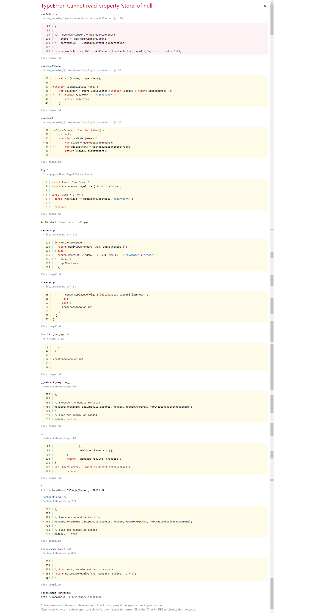

## 问题描述
yarn start 后访问 src/Home/index.tsx（
http://localhost:3333/#/home）
没有问题，可以按照期望得到数据，

但是相同的方法访问 src/Home/Page1/index.tsx（http://localhost:3333/#/home/page1）页面报错如下。



## 目录

```md
│  app.ts
│  global.scss
│  routes.ts
│  typings.d.ts
│
├─components
└─pages
    └─Home
        │  index.tsx
        │
        ├─models
        │      department.ts
        │
        └─Page1
                index.tsx
```
